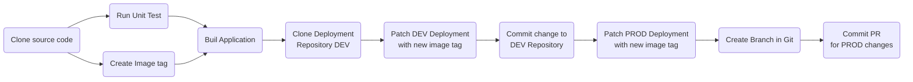

# Deploy Using OpenShift GitOps

## Requirement
* Access to an OpenShift Cluster

* `Have the OpenShift Pipeline Operator install`. For instructions on how to install OpenShift Pipiline you can refer to my [OpenShift Pipeline Demo](https://github.com/froberge/ocp-pipeline-demo) in this [section](https://github.com/froberge/ocp-pipeline-demo/blob/main/docs/install-pipeline-operator.md)

* `Have the OpenShift GitOps Operator install`. For instructions on how to install OpenShift Gitops you can refer to my [OpenShift GitOps Demo](https://github.com/froberge/ocp-gitops-demo) in this [section](https://github.com/froberge/ocp-gitops-demo/blob/main/docs/install-gitops-operator.md)


* `Have a clone/fork of this repository`.

In this demo we will be demontrating how to use `OpenShift` Gitops to manage our application and to deploy an application. To do this we need to deploy an other `ArgoCD instance` that will be use for developers to manage the applications

__NOTE__
*   The default `cluster` instance of Argo CD is meant for cluster admin tasks like creating namespace managing role bindings not for day to day application management.

* `The Developer Argo CD instance` will be deploy in it own namespaces and is intented for the developper to use to manage the application.

1. Login to you cluster using the CLI

1. Use `kustomize` to create the different resources needed to run the demo 
    ```
    oc apply -k gitops-demo/setup/overlays/demo
    ```

    This will create all the elements required    
        * __simple-quarkus-gitops__ - The namespace where the argoCD instance for Developer will be install.
        * __simple-quarkus-pipeline__ - The namespaces where the pipeline resources will be install.
        * __simple-quarkus-dev__ - The `DEV` environment for the demo.
        * __simple-quarkus-prod__ - The `PROD` environment for the demo.

### The Automation Flow.  

The automation flow uses a mix of Tekton and ArgoCD.

Tekton Build the application and creates the PR. ArgoCD monitor the changes in Git. The Pipeline is trigger woth a WebHook from GitHub.




### SetUp GitHub

We need to set up 2 different elements in GitHub
    1. A personel Token on you profile
    2. A Webhook on the code repository


#### Creation of a Personal token creation

From your [GitHub](github.com) account.

1. Under profile Select `setting`.
    

2. Select `Developer settings`

    

3. Select `Personal access tokens`

    

4. Click `Generate new token` and enter the information.

    

    * `Note`: A name for token
    * `Expiration`:When the token should expire according to you security policy.
    *  `Select scopes`: _Repo_ need to be selected at a minumun
    * Click `Generate token`

    > :warning: Copy the generated token in a secure place, since once the window is close, you won't be able to retrieve it. 

5. Generate the require secret for OpenShift to commit.
    * You need to edit the file `../gitops-demo/manifest/github-secret.yaml`
    * Replace following token with the appropriate value
        * `[CLEAR_TEXT_USERNAME]`
        * `[CLEAR_TEXT_TOKEN]`
    * Apply the file to OpenShift
        ```
        oc apply -f gitops-demo/manifest/github-secret.yaml
        ```
    :warning: currently tekton only support basic_auth or ssh, this is why we need to generate one encrypted for the pull request that requires the encrypted token.

6. Generate the require encrypted secret for OpenShift to create a Pull Request.
    * You need to edit the file `../gitops-demo/manifest/github.yaml`
    * You need to replace in base64 the folowwing information
        * token: [64_encoded_token]
        * username: [64_encoded_username]
        * email: [64_encoded_email]
    * Apply the file to OpenShift
    ```
    oc apply -f gitops-demo/manifest/github.yaml
    ```

---
##### Create the GitHub Webhook
1. Retrive the trigger url.     
    ```
    echo "$(oc  get route el-github-webhook -n simple-quarkus-pipeline  --template='http://{{.spec.host}}')"
    ```

2. Open [GitHub](https://github.com/)  in the the code repository, go to setting -> Webhook -> Add Webhook

    

You can now push a change to the repository, it should trigger the pipeline. 

---

#### Make different modification to the application to test the pipeline.

* Modify the source code will trigger the pipeline
* Modify the manifest it will trigger the ArgoCD sync


:tada: CONGRATULATIONS

You have now deploy the service using OpenShift GitOps.

:point_right: Return: [Reposotory content](../README.md)